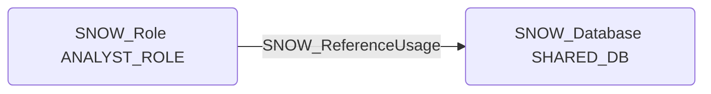

# SNOW_ReferenceUsage

## Edge Schema

- Source: [SNOW_Role](../NodeDescriptions/SNOW_Role.md), [SNOW_ApplicationRole](../NodeDescriptions/SNOW_ApplicationRole.md)
- Destination: [SNOW_Database](../NodeDescriptions/SNOW_Database.md), [SNOW_Schema](../NodeDescriptions/SNOW_Schema.md)

## General Information

The non-traversable `SNOW_ReferenceUsage` edge represents that the source role has been granted the REFERENCE_USAGE privilege on the target database or schema, allowing the role to reference objects within that database or schema in SQL statements such as cross-database joins and views. This enables cross-database queries and joins without requiring full USAGE privilege on the target. While narrower in scope than USAGE, this privilege can facilitate data correlation across database boundaries, potentially allowing an attacker to combine data from multiple sources to derive sensitive insights.

