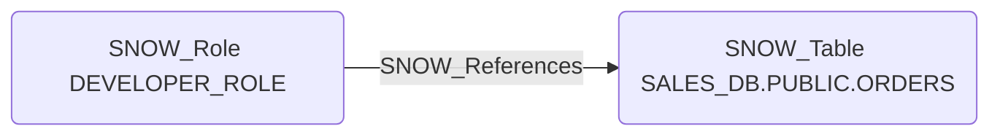

# SNOW_References

## Edge Schema

- Source: [SNOW_Role](../NodeDescriptions/SNOW_Role.md), [SNOW_ApplicationRole](../NodeDescriptions/SNOW_ApplicationRole.md)
- Destination: [SNOW_Table](../NodeDescriptions/SNOW_Table.md), [SNOW_View](../NodeDescriptions/SNOW_View.md)

## General Information

The non-traversable `SNOW_References` edge represents that the source role has been granted the REFERENCES privilege on the target table or view, allowing the role to view the object's foreign key constraints and referential integrity definitions. While primarily used for schema design and cross-table relationship management, REFERENCES reveals table structure information including column names, data types, and inter-table relationships. This metadata exposure can aid an attacker in understanding the data model and identifying high-value targets for further exploitation.

