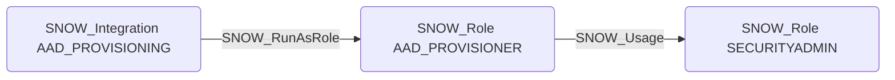

# SNOW_RunAsRole

## Edge Schema

- Source: [SNOW_Integration](../NodeDescriptions/SNOW_Integration.md)
- Destination: [SNOW_Role](../NodeDescriptions/SNOW_Role.md)

## General Information

The non-traversable `SNOW_RunAsRole` edge indicates a security integration (such as SCIM or SSO) executes operations under the specified Snowflake role. This is security-critical because a compromised external identity provider integration could execute operations with the privileges of the run-as role, potentially escalating to high-privilege roles like SECURITYADMIN. Organizations should carefully audit which roles are assigned as run-as roles for integrations, as they represent a trust boundary between external identity systems and Snowflake.

