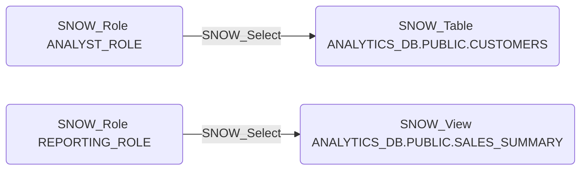

# SNOW_Select

## Edge Schema

- Source: [SNOW_Role](../NodeDescriptions/SNOW_Role.md), [SNOW_ApplicationRole](../NodeDescriptions/SNOW_ApplicationRole.md)
- Destination: [SNOW_Table](../NodeDescriptions/SNOW_Table.md), [SNOW_View](../NodeDescriptions/SNOW_View.md)

## General Information

The non-traversable `SNOW_Select` edge grants the ability to query data from the target table or view. SELECT is the most common data access privilege and a primary concern for data exfiltration. An attacker with SELECT on sensitive tables can read all data contained within, making this edge a critical focus for identifying data exposure risks in Snowflake environments.

