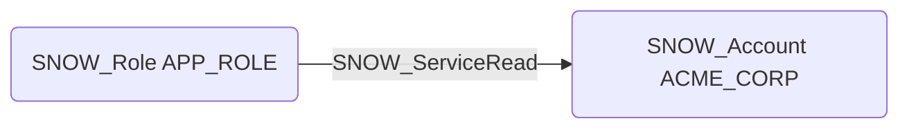

# SNOW_ServiceRead

## Edge Schema

- Source: [SNOW_Role](../NodeDescriptions/SNOW_Role.md), [SNOW_ApplicationRole](../NodeDescriptions/SNOW_ApplicationRole.md)
- Destination: [SNOW_Account](../NodeDescriptions/SNOW_Account.md)

## General Information

The non-traversable `SNOW_ServiceRead` edge represents that the source role has been granted the privilege to read from Snowpark Container Services endpoints within the account. Snowpark Container Services allow users to run containerized applications and services directly within Snowflake, and read access to these service endpoints enables consumption of data and responses produced by running services. This privilege could allow an attacker to access internal service data, query sensitive API endpoints, or extract information from containerized applications that may not be protected by traditional Snowflake object-level access controls.

