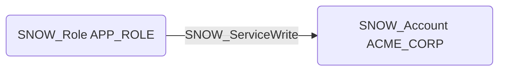

# SNOW_ServiceWrite

## Edge Schema

- Source: [SNOW_Role](../NodeDescriptions/SNOW_Role.md), [SNOW_ApplicationRole](../NodeDescriptions/SNOW_ApplicationRole.md)
- Destination: [SNOW_Account](../NodeDescriptions/SNOW_Account.md)

## General Information

The non-traversable `SNOW_ServiceWrite` edge represents that the source role has been granted the privilege to write to Snowpark Container Services endpoints within the account. Write access to service endpoints enables sending data and commands to containerized applications running within Snowflake. This privilege could allow an attacker to modify service state, inject malicious data into processing pipelines, trigger unintended actions within containerized workloads, or exploit service APIs to escalate privileges within the container environment.

