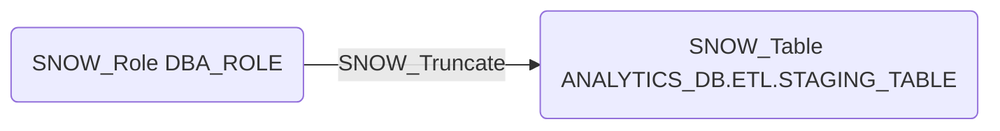

# SNOW_Truncate

## Edge Schema

- Source: [SNOW_Role](../NodeDescriptions/SNOW_Role.md), [SNOW_ApplicationRole](../NodeDescriptions/SNOW_ApplicationRole.md)
- Destination: [SNOW_Table](../NodeDescriptions/SNOW_Table.md)

## General Information

The non-traversable `SNOW_Truncate` edge grants the ability to truncate the target table, removing all rows. Truncate is more destructive than DELETE as it removes all data at once and cannot be rolled back within a transaction. An attacker with TRUNCATE on critical tables could cause catastrophic data loss in a single operation, making this a high-impact privilege that should be tightly controlled.

