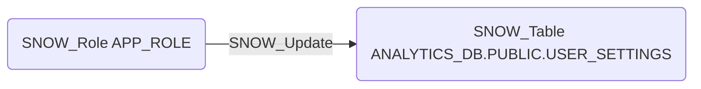

# SNOW_Update

## Edge Schema

- Source: [SNOW_Role](../NodeDescriptions/SNOW_Role.md), [SNOW_ApplicationRole](../NodeDescriptions/SNOW_ApplicationRole.md)
- Destination: [SNOW_Table](../NodeDescriptions/SNOW_Table.md)

## General Information

The non-traversable `SNOW_Update` edge grants the ability to update existing data in the target table. UPDATE access could allow modification of critical business data, audit trails, or permission-related tables. An attacker with UPDATE on sensitive tables could alter financial records, tamper with audit logs to cover tracks, or modify user attributes to escalate privileges at the application layer.

