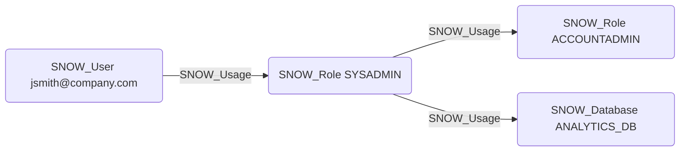

# SNOW_Usage

## Edge Schema

- Source: [SNOW_User](../NodeDescriptions/SNOW_User.md), [SNOW_Role](../NodeDescriptions/SNOW_Role.md), [SNOW_ApplicationRole](../NodeDescriptions/SNOW_ApplicationRole.md)
- Destination: [SNOW_Role](../NodeDescriptions/SNOW_Role.md), [SNOW_Database](../NodeDescriptions/SNOW_Database.md), [SNOW_Warehouse](../NodeDescriptions/SNOW_Warehouse.md), [SNOW_Schema](../NodeDescriptions/SNOW_Schema.md), [SNOW_Integration](../NodeDescriptions/SNOW_Integration.md), [SNOW_Stage](../NodeDescriptions/SNOW_Stage.md)

## General Information

The non-traversable `SNOW_Usage` edge represents the USAGE privilege in Snowflake. For user-to-role relationships, it represents role assignment. For role-to-role relationships, it represents role hierarchy (role inheritance). For role-to-object relationships, it grants the ability to use or reference the object. This is one of the most critical edges for attack path analysis -- role assignments and role hierarchy are the primary mechanisms for privilege escalation in Snowflake. An attacker who gains access to a user with USAGE on a high-privilege role can assume that role and inherit all of its privileges.

