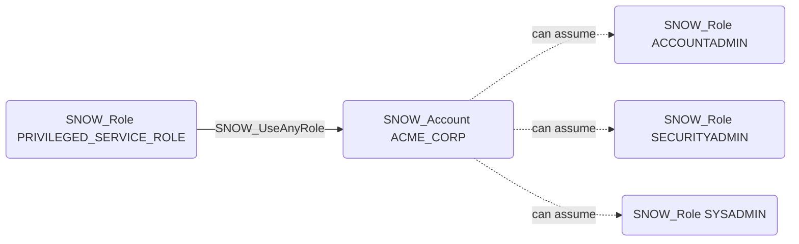

# SNOW_UseAnyRole

## Edge Schema

- Source: [SNOW_Role](../NodeDescriptions/SNOW_Role.md), [SNOW_ApplicationRole](../NodeDescriptions/SNOW_ApplicationRole.md)
- Destination: [SNOW_Account](../NodeDescriptions/SNOW_Account.md)

## General Information

The non-traversable `SNOW_UseAnyRole` edge grants the ability to assume any role on the account. This is an extremely powerful privilege that effectively grants all permissions of every role in the account. A principal with USE ANY ROLE can impersonate any role, making this one of the most dangerous privileges in Snowflake. Any role or user that can reach a role with this privilege through the role hierarchy can effectively become ACCOUNTADMIN or any other role.

