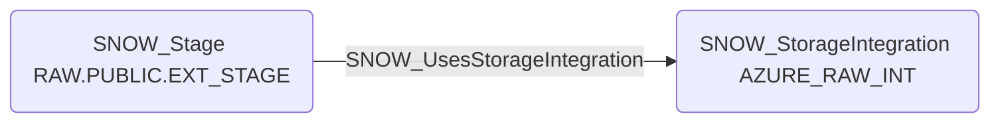

# SNOW_UsesStorageIntegration

## Edge Schema

- Source: [SNOW_Stage](../NodeDescriptions/SNOW_Stage.md)
- Destination: [SNOW_StorageIntegration](../NodeDescriptions/SNOW_StorageIntegration.md)

## General Information

The traversable `SNOW_UsesStorageIntegration` edge indicates an external stage is configured to use a specific storage integration. This edge connects the stage object that exposes data movement semantics to the account-level integration object that authorizes Snowflake-managed access to cloud storage. It is useful for understanding which storage integrations are actually in use and for tracing privilege or exposure paths that depend on external stage configuration.

