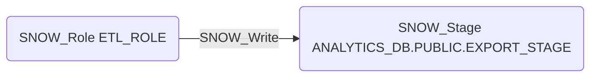

# SNOW_Write

## Edge Schema

- Source: [SNOW_Role](../NodeDescriptions/SNOW_Role.md), [SNOW_ApplicationRole](../NodeDescriptions/SNOW_ApplicationRole.md)
- Destination: [SNOW_Stage](../NodeDescriptions/SNOW_Stage.md)

## General Information

The non-traversable `SNOW_Write` edge grants the ability to write data files to the target stage. An attacker with WRITE could upload malicious files, overwrite legitimate data files, or exfiltrate data to external stages. This is particularly dangerous for external stages backed by cloud storage (S3, Azure Blob, GCS), where written files may be accessible outside of Snowflake's access controls entirely.

