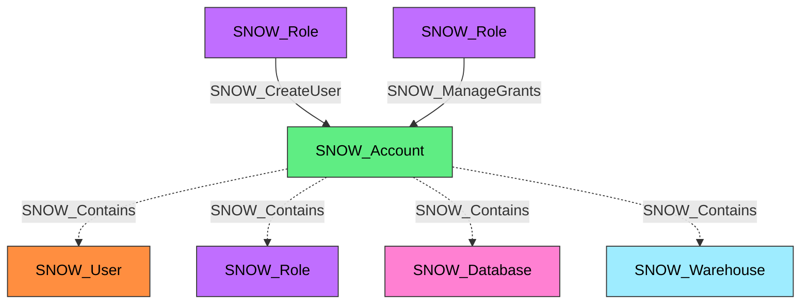

#  Account

A Snowflake account representing an organization's cloud data platform tenant. The Account node is the top-level container for all Snowflake objects and serves as the root of the RBAC hierarchy within SnowHound.

**Created by:** `Invoke-SnowHound`

## Properties

| Property Name | Data Type | Description |
|---|---|---|
| name | string | Display name of the Account |
| environmentid | string | Snowflake-style account identifier used as the graph root ID (`account_name.organization_name`) |
| collected | boolean | Indicates that this account was directly collected by SnowHound |
| fqdn | string | Fully qualified domain name (account_name.organization_name) |
| created_on | datetime | Timestamp when the account was created |
| region | string | Cloud region where the account is hosted |
| region_group | string | Regional group classification |
| edition | string | Snowflake edition (Standard, Enterprise, Business Critical) |
| is_org_admin | string | Whether this account has organization admin privileges |
| is_locked | string | Whether the account is locked |
| account_url | string | URL for accessing the account |
| account_locator | string | Short unique identifier for the account |
| managed_accounts | string | Number of managed accounts |
| is_managed | string | Whether this is a managed account |
| parent_account | string | Parent account identifier if managed |

## Edges

### Outbound Edges

| Edge Kind | Target Node | Traversable | Description |
|---|---|---|---|
| SNOW_Contains | SNOW_User | No | Account contains user objects |
| SNOW_Contains | SNOW_Role | No | Account contains role objects |
| SNOW_Contains | SNOW_Application | No | Account contains native applications |
| SNOW_Contains | SNOW_ApplicationRole | No | Account contains application roles |
| SNOW_Contains | SNOW_Warehouse | No | Account contains warehouses |
| SNOW_Contains | SNOW_Database | No | Account contains databases |
| SNOW_Contains | SNOW_Schema | No | Account contains schemas |
| SNOW_Contains | SNOW_Stage | No | Account contains stages |
| SNOW_Contains | SNOW_Table | No | Account contains tables |
| SNOW_Contains | SNOW_View | No | Account contains views |
| SNOW_Contains | SNOW_Integration | No | Account contains integrations |
| SNOW_Contains | SNOW_Function | No | Account contains functions |
| SNOW_Contains | SNOW_Procedure | No | Account contains procedures |

### Inbound Edges

| Edge Kind | Source Node | Traversable | Description |
|---|---|---|---|
| SNOW_CreateAccount | SNOW_Role / SNOW_ApplicationRole | Yes | Role has CREATE ACCOUNT privilege |
| SNOW_CreateUser | SNOW_Role / SNOW_ApplicationRole | Yes | Role has CREATE USER privilege |
| SNOW_CreateRole | SNOW_Role / SNOW_ApplicationRole | Yes | Role has CREATE ROLE privilege |
| SNOW_CreateDatabase | SNOW_Role / SNOW_ApplicationRole | Yes | Role has CREATE DATABASE privilege |
| SNOW_CreateWarehouse | SNOW_Role / SNOW_ApplicationRole | Yes | Role has CREATE WAREHOUSE privilege |
| SNOW_CreateIntegration | SNOW_Role / SNOW_ApplicationRole | Yes | Role has CREATE INTEGRATION privilege |
| SNOW_ManageGrants | SNOW_Role / SNOW_ApplicationRole | Yes | Role has MANAGE GRANTS privilege |
| SNOW_ExecuteTask | SNOW_Role / SNOW_ApplicationRole | Yes | Role has EXECUTE TASK privilege |
| SNOW_MonitorExecution | SNOW_Role / SNOW_ApplicationRole | Yes | Role has MONITOR EXECUTION privilege |
| SNOW_Audit | SNOW_Role / SNOW_ApplicationRole | Yes | Role has AUDIT privilege |

> Non-traversable administrative edges omitted for clarity. See edge tables above for the complete list.

## Diagram

