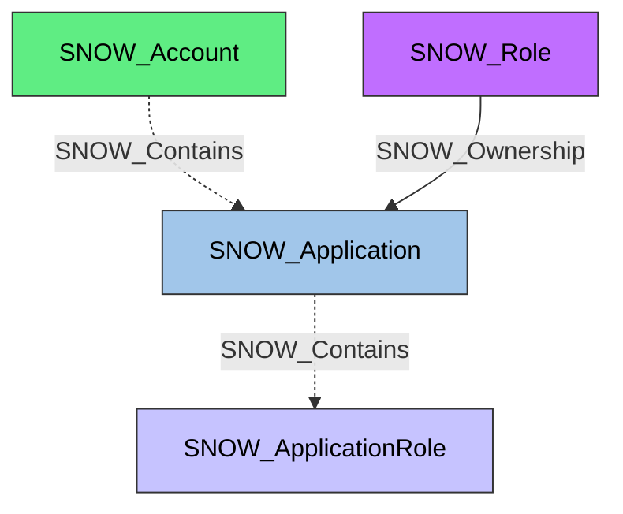

#  Application

A Snowflake Native App installed in the account. Applications encapsulate data products and functionality that can be shared across Snowflake accounts, and they define their own application roles to control access to their features.

**Created by:** `Invoke-SnowHound`

## Properties

| Property Name | Data Type | Description |
|---|---|---|
| name | string | Display name of the Application |
| fqdn | string | Fully qualified domain name |
| created_on | datetime | Timestamp when the application was created |
| is_default | string | Whether this is a default application |
| is_current | string | Whether this is the current application |
| source_type | string | Source type of the application |
| owner | string | Role that owns this application |
| comment | string | Administrative comment |
| version | string | Application version |
| label | string | Application label |
| patch | string | Patch level |
| options | string | Application options |
| retention_time | string | Data retention time |
| upgrade_state | string | Current upgrade state |
| disablement_reasons | string | Reasons if application is disabled |
| last_upgraded_on | datetime | Timestamp of last upgrade |
| release_channel_name | string | Release channel name |
| type | string | Application type |

## Edges

### Outbound Edges

| Edge Kind | Target Node | Traversable | Description |
|---|---|---|---|
| SNOW_Contains | SNOW_ApplicationRole | No | Application contains its application roles |

### Inbound Edges

| Edge Kind | Source Node | Traversable | Description |
|---|---|---|---|
| SNOW_Contains | SNOW_Account | No | Account contains this application |
| SNOW_Ownership | SNOW_Role | Yes | Role owns this application |

## Diagram

