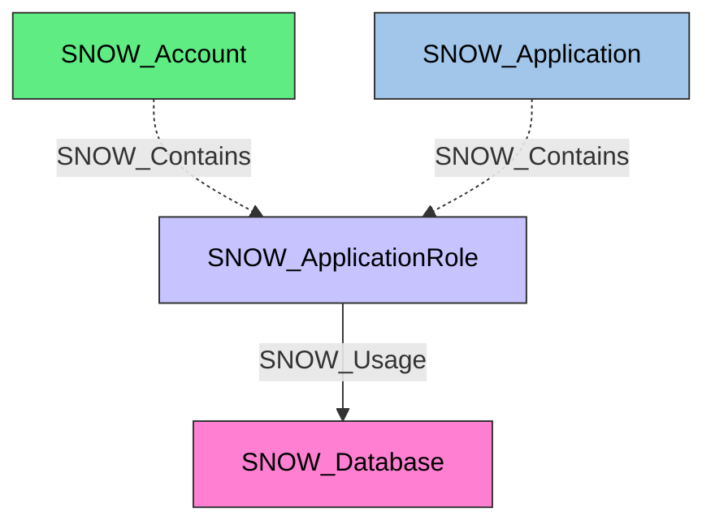

#  Application Role

A role defined within a Snowflake Native App that controls access to application functionality. Application roles follow the same privilege model as standard roles but are scoped to their parent application.

**Created by:** `Invoke-SnowHound`

## Properties

| Property Name | Data Type | Description |
|---|---|---|
| name | string | Display name of the Application Role |
| created_on | datetime | Timestamp when the application role was created |
| owner | string | Role that owns this application role |
| comment | string | Administrative comment |
| owner_role_type | string | Type of the owner role |

## Edges

### Outbound Edges

| Edge Kind | Target Node | Traversable | Description |
|---|---|---|---|
| All privilege edges | Various targets | Yes | Application role has privilege on target (same privilege edge pattern as SNOW_Role) |

> SNOW_ApplicationRole supports the same set of privilege edges as SNOW_Role. Refer to the SNOW_Role documentation for the full list of outbound privilege edge types.

### Inbound Edges

| Edge Kind | Source Node | Traversable | Description |
|---|---|---|---|
| SNOW_Contains | SNOW_Application | No | Application contains this application role |
| SNOW_Contains | SNOW_Account | No | Account contains this application role |

## Diagram

