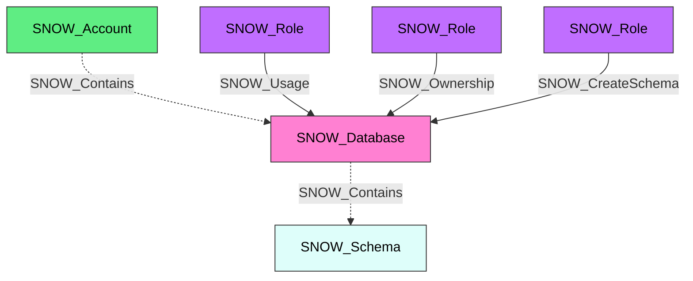

#  Database

A Snowflake database that serves as a logical container for schemas and data objects. Databases are the primary organizational unit in Snowflake's object hierarchy, sitting between the account and schema levels.

**Created by:** `Invoke-SnowHound`

## Properties

| Property Name | Data Type | Description |
|---|---|---|
| name | string | Display name of the Database |
| fqdn | string | Fully qualified domain name |
| created_on | datetime | Timestamp when the database was created |
| is_default | string | Whether this is the default database |
| is_current | string | Whether this is the current database |
| origin | string | Origin of the database if shared or replicated |
| owner | string | Role that owns this database |
| comment | string | Administrative comment |
| options | string | Database options |
| retention_time | string | Data retention time in days |
| kind | string | Database kind |
| owner_role_type | string | Type of the owner role |
| object_visibility | string | Object visibility setting |

## Edges

### Outbound Edges

| Edge Kind | Target Node | Traversable | Description |
|---|---|---|---|
| SNOW_Contains | SNOW_Schema | No | Database contains schemas |

### Inbound Edges

| Edge Kind | Source Node | Traversable | Description |
|---|---|---|---|
| SNOW_Contains | SNOW_Account | No | Account contains this database |
| SNOW_Usage | SNOW_Role | Yes | Role has USAGE privilege on this database |
| SNOW_Ownership | SNOW_Role | Yes | Role owns this database |
| SNOW_Modify | SNOW_Role | Yes | Role can modify database properties |
| SNOW_Monitor | SNOW_Role | Yes | Role can monitor this database |
| SNOW_CreateSchema | SNOW_Role | Yes | Role can create schemas in this database |
| SNOW_CreateDatabaseRole | SNOW_Role | Yes | Role can create database roles in this database |

## Diagram

