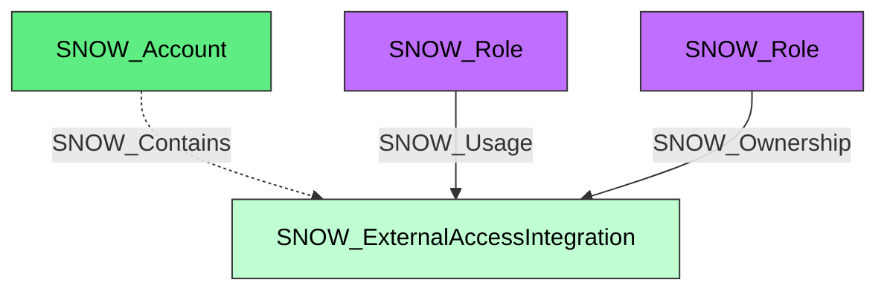

#  External Access Integration

A Snowflake external access integration that governs outbound access from handlers such as functions and procedures to external network locations. External access integrations are represented as concrete integration nodes and also carry the shared `SNOW_Integration` kind.

**Created by:** `Invoke-SnowHound`

## Properties

| Property Name | Data Type | Description |
|---|---|---|
| name | string | Display name of the external access integration |
| fqdn | string | Fully qualified domain name |
| type | string | Integration type |
| category | string | Integration category (`EXTERNAL_ACCESS`) |
| created_on | datetime | Timestamp when the integration was created |
| (conditional) | various | Additional normalized properties from `DESCRIBE EXTERNAL ACCESS INTEGRATION` |

## Edges

### Outbound Edges

| Edge Kind | Target Node | Traversable | Description |
|---|---|---|---|
| (none) | | | External access integrations currently have no integration-specific outbound edges |

### Inbound Edges

| Edge Kind | Source Node | Traversable | Description |
|---|---|---|---|
| SNOW_Contains | SNOW_Account | No | Account contains this external access integration |
| SNOW_Usage | SNOW_Role | Yes | Role has usage privilege |
| SNOW_Ownership | SNOW_Role | Yes | Role owns this external access integration |

## Diagram

