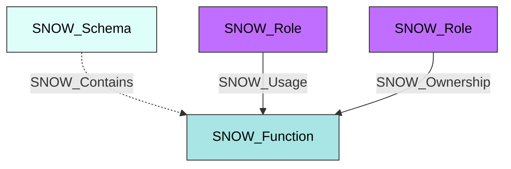

#  Function

A user-defined or external function registered in a Snowflake schema. Functions encapsulate reusable logic that can be invoked in SQL queries, supporting multiple implementation languages and function types including scalar, table, aggregate, and external functions.

> **Note:** Currently commented out in the collector but defined in the schema.

**Created by:** `Invoke-SnowHound`

## Properties

| Property Name | Data Type | Description |
|---|---|---|
| name | string | Display name of the Function |
| fqdn | string | Fully qualified domain name (db.schema.function@account.org) |
| created_on | datetime | Timestamp when the function was created |
| schema_name | string | Parent schema name |
| is_builtin | string | Whether this is a built-in function |
| is_aggregate | string | Whether this is an aggregate function |
| is_ansi | string | Whether this is an ANSI-compliant function |
| min_num_arguments | integer | Minimum number of arguments |
| max_num_arguments | integer | Maximum number of arguments |
| arguments | string | Function argument signature |
| description | string | Function description |
| catalog_name | string | Parent database (catalog) name |
| is_table_function | string | Whether this is a table function |
| valid_for_clustering | string | Whether valid for clustering |
| is_secure | string | Whether this is a secure function |
| secrets | string | Associated secrets |
| external_access_integrations | string | External access integrations |
| is_external_function | string | Whether this is an external function |
| language | string | Implementation language |
| is_memoizable | string | Whether results can be memoized |
| is_data_metric | string | Whether this is a data metric function |

## Edges

### Outbound Edges

| Edge Kind | Target Node | Traversable | Description |
|---|---|---|---|
| (none) | | | Functions have no outbound edges |

### Inbound Edges

| Edge Kind | Source Node | Traversable | Description |
|---|---|---|---|
| SNOW_Contains | SNOW_Account | No | Account contains this function |
| SNOW_Contains | SNOW_Schema | No | Schema contains this function |
| SNOW_Usage | SNOW_Role | Yes | Role has usage privilege |
| SNOW_Ownership | SNOW_Role | Yes | Role owns this function |

## Diagram

