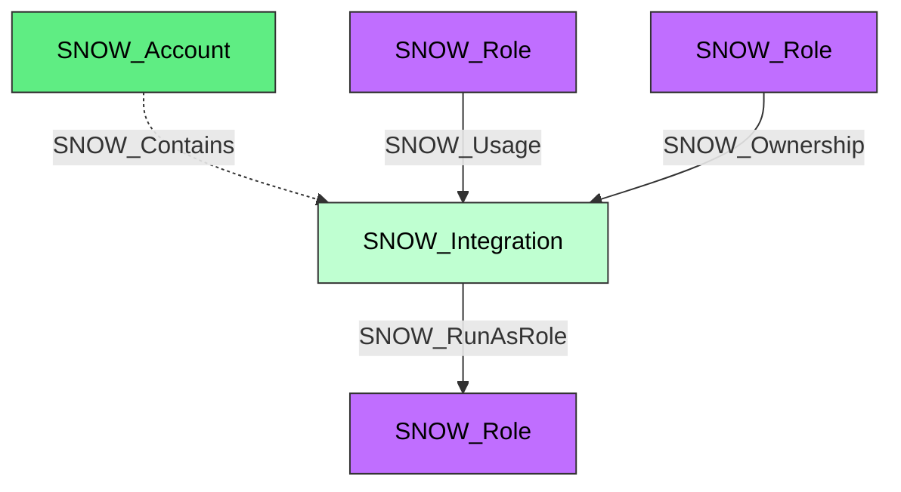

#  Integration

A Snowflake integration object that connects to external services (API, security, storage, etc.). Integrations provide a bridge between Snowflake and external systems, supporting categories such as API, CATALOG, EXTERNAL_ACCESS, NOTIFICATION, SECURITY, and STORAGE.

**Created by:** `Invoke-SnowHound`

## Properties

| Property Name | Data Type | Description |
|---|---|---|
| name | string | Display name of the Integration |
| fqdn | string | Fully qualified domain name |
| type | string | Integration type |
| category | string | Integration category (API, CATALOG, EXTERNAL_ACCESS, NOTIFICATION, SECURITY, STORAGE) |
| created_on | datetime | Timestamp when the integration was created |
| (conditional) | various | Additional properties from DESCRIBE SECURITY INTEGRATION for SECURITY category |

## Edges

### Outbound Edges

| Edge Kind | Target Node | Traversable | Description |
|---|---|---|---|
| SNOW_RunAsRole | SNOW_Role | Yes | Security integration runs as this role |

### Inbound Edges

| Edge Kind | Source Node | Traversable | Description |
|---|---|---|---|
| SNOW_Contains | SNOW_Account | No | Account contains this integration |
| SNOW_Usage | SNOW_Role | Yes | Role has usage privilege |
| SNOW_Ownership | SNOW_Role | Yes | Role owns this integration |

## Diagram

