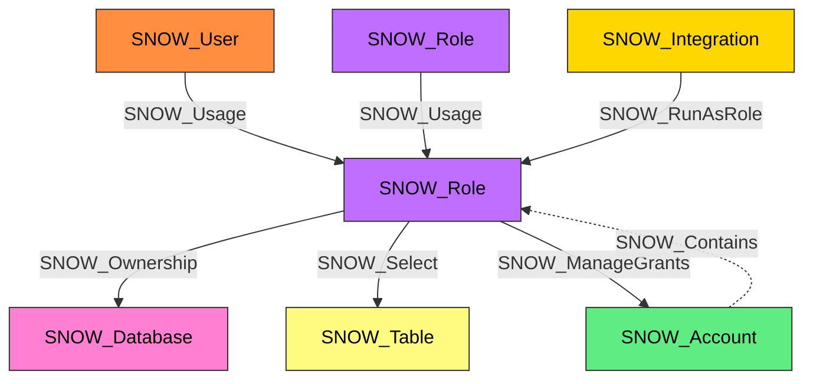

#  Role

A Snowflake role that groups privileges and can be assigned to users or other roles. Roles form the backbone of Snowflake's RBAC model and can be organized into hierarchies where parent roles inherit the privileges of child roles.

**Created by:** `Invoke-SnowHound`

## Properties

| Property Name | Data Type | Description |
|---|---|---|
| name | string | Display name of the Role |
| fqdn | string | Fully qualified domain name (name@account.org) |
| created_on | datetime | Timestamp when the role was created |
| is_default | string | Whether this is a default role |
| is_current | string | Whether this is the current session role |
| is_inherited | string | Whether the role is inherited |
| assigned_to_users | string | Number of users assigned to this role |
| granted_to_roles | string | Number of roles this role is granted to |
| granted_roles | string | Number of roles granted to this role |
| owner | string | Role that owns this role |
| comment | string | Administrative comment |

## Edges

### Outbound Edges

| Edge Kind | Target Node | Traversable | Description |
|---|---|---|---|
| SNOW_Usage | SNOW_Role, SNOW_Database, SNOW_Warehouse, SNOW_Schema, SNOW_Integration, SNOW_Stage | Yes | Role has USAGE privilege on target |
| SNOW_Ownership | All object types | Yes | Role owns the target object |
| SNOW_Select | SNOW_Table, SNOW_View | Yes | Role has SELECT privilege on target |
| SNOW_Insert | SNOW_Table | Yes | Role has INSERT privilege on target |
| SNOW_Update | SNOW_Table | Yes | Role has UPDATE privilege on target |
| SNOW_Delete | SNOW_Table | Yes | Role has DELETE privilege on target |
| SNOW_CreateUser | SNOW_Account | Yes | Role has CREATE USER privilege at account level |
| SNOW_CreateRole | SNOW_Account | Yes | Role has CREATE ROLE privilege at account level |
| SNOW_CreateDatabase | SNOW_Account | Yes | Role has CREATE DATABASE privilege at account level |
| SNOW_ManageGrants | SNOW_Account | Yes | Role has MANAGE GRANTS privilege at account level |
| SNOW_Modify | SNOW_Database, SNOW_Warehouse, SNOW_Schema | Yes | Role has MODIFY privilege on target |
| SNOW_Monitor | SNOW_Database, SNOW_Warehouse | Yes | Role has MONITOR privilege on target |
| SNOW_Operate | SNOW_Warehouse | Yes | Role has OPERATE privilege on target |

> SNOW_Role has approximately 60+ outbound edge types representing the full set of Snowflake privileges. Only the most common edges are listed above. See the SnowHound source code for the complete edge list.

### Inbound Edges

| Edge Kind | Source Node | Traversable | Description |
|---|---|---|---|
| SNOW_Contains | SNOW_Account | No | Account contains this role |
| SNOW_Usage | SNOW_User | Yes | User is assigned to this role |
| SNOW_Usage | SNOW_Role | Yes | Role is granted to this role (role hierarchy) |
| SNOW_RunAsRole | SNOW_Integration | Yes | Integration runs as this role |
| SNOW_Ownership | SNOW_Role | Yes | Another role owns this role |

> Non-traversable administrative edges and many privilege edges omitted for clarity. SNOW_Role has 60+ outbound edge types. See edge tables above for the complete list.

## Diagram

