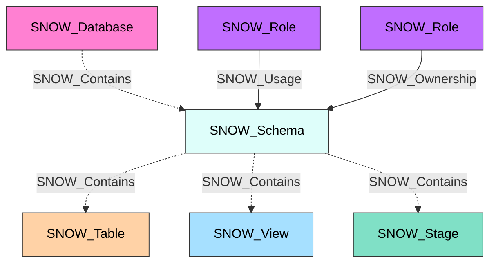

#  Schema

A Snowflake schema that organizes database objects within a database. Schemas serve as logical containers for tables, views, stages, functions, and procedures, providing a namespace for organizing and controlling access to these objects.

**Created by:** `Invoke-SnowHound`

## Properties

| Property Name | Data Type | Description |
|---|---|---|
| name | string | Display name of the Schema |
| fqdn | string | Fully qualified domain name (database.schema@account.org) |
| database_name | string | Parent database name |
| created_on | datetime | Timestamp when the schema was created |
| is_default | string | Whether this is the default schema |
| is_current | string | Whether this is the current schema |
| owner | string | Role that owns this schema |
| comment | string | Administrative comment |
| options | string | Schema options |
| retention_time | string | Data retention time in days |
| owner_role_type | string | Type of the owner role |
| classification_profile_database | string | Classification profile database |
| classification_profile_schema | string | Classification profile schema |
| classification_profile | string | Classification profile name |
| object_visibility | string | Object visibility setting |

## Edges

### Outbound Edges

| Edge Kind | Target Node | Traversable | Description |
|---|---|---|---|
| SNOW_Contains | SNOW_Table | No | Schema contains tables |
| SNOW_Contains | SNOW_View | No | Schema contains views |
| SNOW_Contains | SNOW_Stage | No | Schema contains stages |
| SNOW_Contains | SNOW_Function | No | Schema contains functions |
| SNOW_Contains | SNOW_Procedure | No | Schema contains procedures |

### Inbound Edges

| Edge Kind | Source Node | Traversable | Description |
|---|---|---|---|
| SNOW_Contains | SNOW_Account | No | Account contains this schema |
| SNOW_Contains | SNOW_Database | No | Database contains this schema |
| SNOW_Usage | SNOW_Role | Yes | Role has usage privilege |
| SNOW_Ownership | SNOW_Role | Yes | Role owns this schema |
| SNOW_Modify | SNOW_Role | Yes | Role can modify this schema |
| SNOW_Monitor | SNOW_Role | Yes | Role can monitor this schema |
| SNOW_CreateSchema | SNOW_Role | Yes | Role can create schemas (at database level) |
| Various SNOW_Create* | SNOW_Role | Yes | Role can create objects within this schema |

## Diagram

