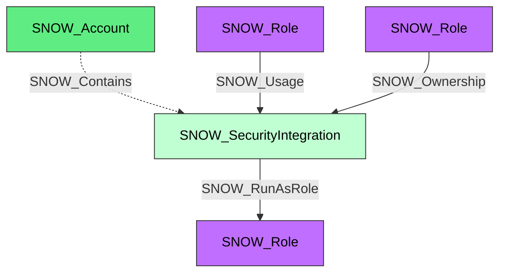

#  Security Integration

A Snowflake security integration that connects Snowflake authentication, provisioning, or identity workflows to an external identity system. Security integrations are represented as concrete integration nodes and also carry the shared `SNOW_Integration` kind.

**Created by:** `Invoke-SnowHound`

## Properties

| Property Name | Data Type | Description |
|---|---|---|
| name | string | Display name of the security integration |
| fqdn | string | Fully qualified domain name |
| environmentid | string | Snowflake account identifier for the environment that contains this integration |
| type | string | Integration type |
| category | string | Integration category (`SECURITY`) |
| created_on | datetime | Timestamp when the integration was created |
| (conditional) | various | Additional normalized properties from `DESCRIBE SECURITY INTEGRATION` |

## Edges

### Outbound Edges

| Edge Kind | Target Node | Traversable | Description |
|---|---|---|---|
| SNOW_RunAsRole | SNOW_Role | Yes | Security integration runs as this role |

### Inbound Edges

| Edge Kind | Source Node | Traversable | Description |
|---|---|---|---|
| SNOW_Contains | SNOW_Account | No | Account contains this security integration |
| SNOW_Usage | SNOW_Role | Yes | Role has usage privilege |
| SNOW_Ownership | SNOW_Role | Yes | Role owns this security integration |

## Diagram

