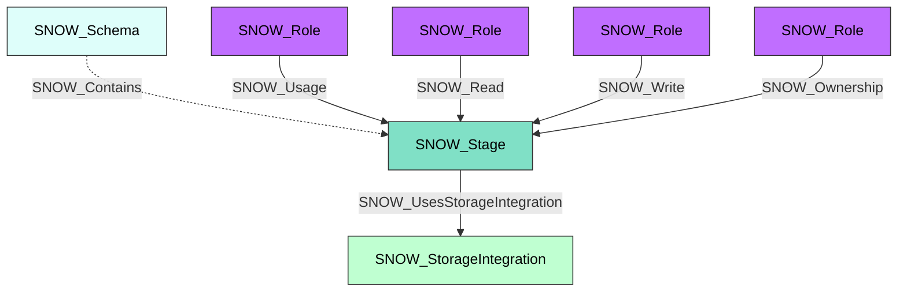

#  Stage

A Snowflake stage that references a location for data files used in loading and unloading. Stages can be internal (managed by Snowflake) or external (pointing to cloud storage such as S3, Azure Blob, or GCS), and serve as the intermediary for bulk data operations.

**Created by:** `Invoke-SnowHound`

## Properties

| Property Name | Data Type | Description |
|---|---|---|
| name | string | Display name of the Stage |
| fqdn | string | Fully qualified domain name (db.schema.stage@account.org) |
| created_on | datetime | Timestamp when the stage was created |
| database_name | string | Parent database name |
| schema_name | string | Parent schema name |
| url | string | Stage URL (for external stages) |
| has_credentials | string | Whether the stage has stored credentials |
| has_encryption_key | string | Whether the stage has an encryption key |
| owner | string | Role that owns this stage |
| comment | string | Administrative comment |
| region | string | Cloud region |
| type | string | Stage type (internal, external) |
| cloud | string | Cloud provider |
| notification_channel | string | Notification channel ARN/URL |
| storage_integration | string | Associated storage integration |
| endpoint | string | Stage endpoint |
| owner_role_type | string | Type of the owner role |
| directory_enabled | string | Whether directory table is enabled |

## Edges

### Outbound Edges

| Edge Kind | Target Node | Traversable | Description |
|---|---|---|---|
| SNOW_UsesStorageIntegration | SNOW_StorageIntegration | Yes | Stage uses this storage integration |

### Inbound Edges

| Edge Kind | Source Node | Traversable | Description |
|---|---|---|---|
| SNOW_Contains | SNOW_Account | No | Account contains this stage |
| SNOW_Contains | SNOW_Schema | No | Schema contains this stage |
| SNOW_Usage | SNOW_Role | Yes | Role has usage privilege |
| SNOW_Read | SNOW_Role | Yes | Role can read from this stage |
| SNOW_Write | SNOW_Role | Yes | Role can write to this stage |
| SNOW_Ownership | SNOW_Role | Yes | Role owns this stage |

## Diagram

