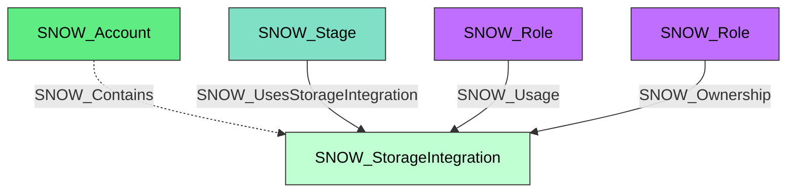

#  Storage Integration

A Snowflake storage integration that links Snowflake-managed access to external cloud storage. Storage integrations are commonly referenced by external stages and are represented as concrete integration nodes that also carry the shared `SNOW_Integration` kind.

**Created by:** `Invoke-SnowHound`

## Properties

| Property Name | Data Type | Description |
|---|---|---|
| name | string | Display name of the storage integration |
| fqdn | string | Fully qualified domain name |
| type | string | Integration type |
| category | string | Integration category (`STORAGE`) |
| created_on | datetime | Timestamp when the integration was created |
| (conditional) | various | Additional normalized properties from `DESCRIBE STORAGE INTEGRATION` |

## Edges

### Outbound Edges

| Edge Kind | Target Node | Traversable | Description |
|---|---|---|---|
| (none) | | | Storage integrations currently have no integration-specific outbound edges |

### Inbound Edges

| Edge Kind | Source Node | Traversable | Description |
|---|---|---|---|
| SNOW_Contains | SNOW_Account | No | Account contains this storage integration |
| SNOW_UsesStorageIntegration | SNOW_Stage | Yes | Stage uses this storage integration |
| SNOW_Usage | SNOW_Role | Yes | Role has usage privilege |
| SNOW_Ownership | SNOW_Role | Yes | Role owns this storage integration |

## Diagram

