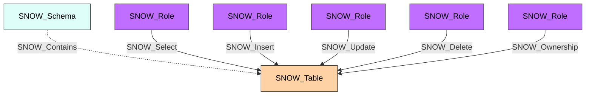

#  Table

A Snowflake table that stores structured data. Tables are the primary data storage objects in Snowflake and support a variety of types including standard, external, hybrid, Iceberg, dynamic, and immutable tables.

**Created by:** `Invoke-SnowHound`

## Properties

| Property Name | Data Type | Description |
|---|---|---|
| name | string | Display name of the Table |
| fqdn | string | Fully qualified domain name (db.schema.table@account.org) |
| created_on | datetime | Timestamp when the table was created |
| database_name | string | Parent database name |
| schema_name | string | Parent schema name |
| kind | string | Table kind |
| comment | string | Administrative comment |
| cluster_by | string | Clustering key expression |
| rows | integer | Number of rows |
| bytes | integer | Size in bytes |
| owner | string | Role that owns this table |
| retention_time | string | Data retention time in days |
| change_tracking | string | Whether change tracking is enabled |
| is_external | string | Whether this is an external table |
| enable_schema_evolution | string | Whether schema evolution is enabled |
| owner_role_type | string | Type of the owner role |
| is_event | string | Whether this is an event table |
| is_hybrid | string | Whether this is a hybrid table |
| is_iceberg | string | Whether this is an Iceberg table |
| is_dynamic | string | Whether this is a dynamic table |
| is_immutable | string | Whether this is an immutable table |

## Edges

### Outbound Edges

| Edge Kind | Target Node | Traversable | Description |
|---|---|---|---|
| (none) | | | Tables have no outbound edges |

### Inbound Edges

| Edge Kind | Source Node | Traversable | Description |
|---|---|---|---|
| SNOW_Contains | SNOW_Account | No | Account contains this table |
| SNOW_Contains | SNOW_Schema | No | Schema contains this table |
| SNOW_Select | SNOW_Role | Yes | Role can query this table |
| SNOW_Insert | SNOW_Role | Yes | Role can insert into this table |
| SNOW_Update | SNOW_Role | Yes | Role can update this table |
| SNOW_Delete | SNOW_Role | Yes | Role can delete from this table |
| SNOW_Truncate | SNOW_Role | Yes | Role can truncate this table |
| SNOW_References | SNOW_Role | Yes | Role can reference this table |
| SNOW_Ownership | SNOW_Role | Yes | Role owns this table |

## Diagram

