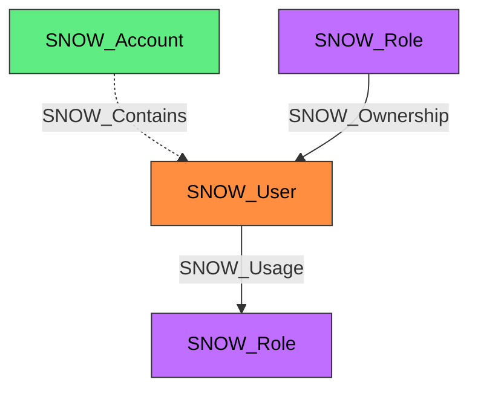

#  User

A Snowflake user account that can authenticate and interact with the platform. Users are assigned roles via the SNOW_Usage edge and inherit the privileges of those roles to access Snowflake objects.

**Created by:** `Invoke-SnowHound`

## Properties

| Property Name | Data Type | Description |
|---|---|---|
| name | string | Display name of the User |
| fqdn | string | Fully qualified domain name (name@account.org) |
| environmentid | string | Snowflake account identifier for the environment that contains this user |
| created_on | datetime | Timestamp when the user was created |
| login_name | string | Login identifier for authentication |
| display_name | string | Human-readable display name |
| first_name | string | User's first name |
| last_name | string | User's last name |
| email | string | Email address |
| mins_to_unlock | string | Minutes until account auto-unlocks |
| days_to_expiry | string | Days until password expires |
| comment | string | Administrative comment |
| disabled | string | Whether the user is disabled |
| must_change_password | string | Whether password change is required on next login |
| snowflake_lock | string | Whether the user is locked by Snowflake |
| default_warehouse | string | Default warehouse for sessions |
| default_namespace | string | Default namespace for sessions |
| default_role | string | Default role for sessions |
| default_secondary_roles | string | Default secondary roles |
| ext_authn_duo | string | Duo MFA authentication status |
| ext_authn_uid | string | External authentication UID |
| mins_to_bypass_mfa | string | Minutes to bypass MFA |
| owner | string | Role that owns this user |
| last_successful_login | datetime | Timestamp of last successful login |
| expires_at_time | datetime | Timestamp when the user expires |
| locked_until_time | datetime | Timestamp until which user is locked |
| has_password | string | Whether the user has a password set |
| has_rsa_public_key | string | Whether the user has an RSA public key |
| type | string | User type |
| has_mfa | string | Whether MFA is enabled |
| has_pat | string | Whether personal access tokens are enabled |
| has_workload_identity | string | Whether workload identity is configured |
| scim_user_name | string | SCIM username when the user was provisioned or updated through an enabled SCIM security integration |

## Edges

### Outbound Edges

| Edge Kind | Target Node | Traversable | Description |
|---|---|---|---|
| SNOW_Usage | SNOW_Role | Yes | User is assigned to a role |

### Inbound Edges

| Edge Kind | Source Node | Traversable | Description |
|---|---|---|---|
| SNOW_Contains | SNOW_Account | No | Account contains this user |
| SNOW_Ownership | SNOW_Role | Yes | Role owns this user |

## Diagram

