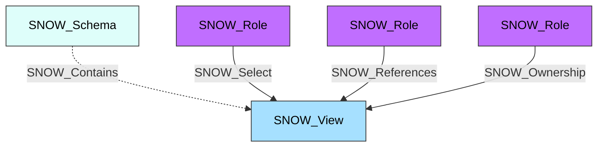

#  View

A Snowflake view that provides a virtual table based on a SQL query. Views allow users to present data from one or more tables in a customized way without duplicating the underlying data. Views can be standard, secure, or materialized.

**Created by:** `Invoke-SnowHound`

## Properties

| Property Name | Data Type | Description |
|---|---|---|
| name | string | Display name of the View |
| fqdn | string | Fully qualified domain name (db.schema.view@account.org) |
| created_on | datetime | Timestamp when the view was created |
| reserved | string | Reserved field |
| database_name | string | Parent database name |
| schema_name | string | Parent schema name |
| owner | string | Role that owns this view |
| comment | string | Administrative comment |
| text | string | View definition SQL text |
| is_secure | string | Whether this is a secure view |
| is_materialized | string | Whether this is a materialized view |
| owner_role_type | string | Type of the owner role |
| change_tracking | string | Whether change tracking is enabled |

## Edges

### Outbound Edges

| Edge Kind | Target Node | Traversable | Description |
|---|---|---|---|
| (none) | | | Views have no outbound edges |

### Inbound Edges

| Edge Kind | Source Node | Traversable | Description |
|---|---|---|---|
| SNOW_Contains | SNOW_Account | No | Account contains this view |
| SNOW_Contains | SNOW_Schema | No | Schema contains this view |
| SNOW_Select | SNOW_Role | Yes | Role can query this view |
| SNOW_References | SNOW_Role | Yes | Role can reference this view |
| SNOW_Ownership | SNOW_Role | Yes | Role owns this view |

## Diagram

