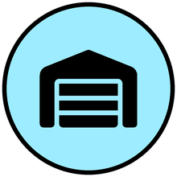
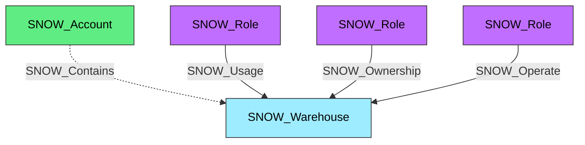

#  Warehouse

A Snowflake virtual warehouse that provides compute resources for queries and operations. Warehouses are the execution engine for SQL queries and DML operations, and access to them is controlled through role-based privileges.

**Created by:** `Invoke-SnowHound`

## Properties

| Property Name | Data Type | Description |
|---|---|---|
| name | string | Display name of the Warehouse |
| fqdn | string | Fully qualified domain name |
| state | string | Current operational state |
| type | string | Warehouse type |
| size | string | Warehouse size (X-Small to 6X-Large) |
| running | string | Number of running queries |
| queued | string | Number of queued queries |
| is_default | string | Whether this is the default warehouse |
| is_current | string | Whether this is the current warehouse |
| auto_suspend | string | Auto-suspend timeout in seconds |
| auto_resume | string | Whether auto-resume is enabled |
| available | string | Available capacity |
| provisioning | string | Provisioning capacity |
| quiescing | string | Quiescing capacity |
| other | string | Other capacity |
| created_on | datetime | Timestamp when the warehouse was created |
| resumed_on | datetime | Timestamp when last resumed |
| updated_on | datetime | Timestamp when last updated |
| owner | string | Role that owns this warehouse |
| comment | string | Administrative comment |
| resource_monitor | string | Associated resource monitor |
| actives | string | Active cluster count |
| pendings | string | Pending cluster count |
| failed | string | Failed cluster count |
| suspended | string | Suspended cluster count |
| uuid | string | Unique identifier |
| owner_role_type | string | Type of the owner role |
| resource_constraint | string | Resource constraint setting |
| warehouse_credit_limit | string | Credit limit |
| target_statement_size | string | Target statement size |
| disabled_reasons | string | Reasons if disabled |

## Edges

### Outbound Edges

| Edge Kind | Target Node | Traversable | Description |
|---|---|---|---|
| — | — | — | SNOW_Warehouse has no outbound edges |

### Inbound Edges

| Edge Kind | Source Node | Traversable | Description |
|---|---|---|---|
| SNOW_Contains | SNOW_Account | No | Account contains this warehouse |
| SNOW_Usage | SNOW_Role | Yes | Role has USAGE privilege on this warehouse |
| SNOW_Ownership | SNOW_Role | Yes | Role owns this warehouse |
| SNOW_Operate | SNOW_Role | Yes | Role can start, stop, and resume this warehouse |
| SNOW_Monitor | SNOW_Role | Yes | Role can monitor this warehouse |
| SNOW_Modify | SNOW_Role | Yes | Role can modify warehouse properties |
| SNOW_ApplyBudget | SNOW_Role | Yes | Role can apply budget controls to this warehouse |

## Diagram

