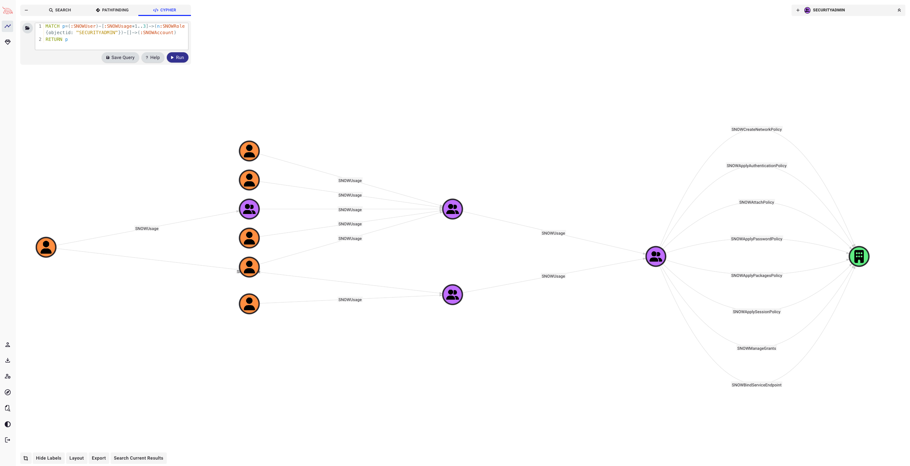
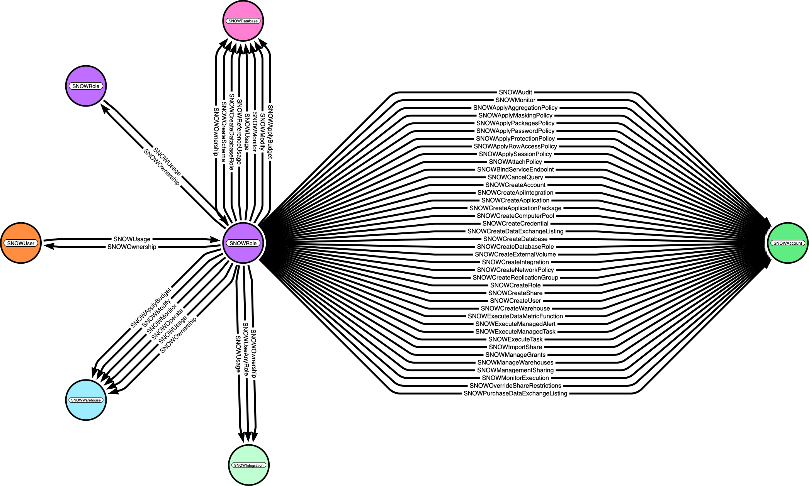

# SnowHound



## Overview

The BloodHound extension for Snowflake provides a powerful way to visualize access control and potential attack paths within a Snowflake environment. By mapping key entities such as Users, Roles, Databases, Warehouses, and Integrations, along with the permissions that connect them, this extension enables security teams to gain a comprehensive understanding of their Snowflake landscape. The extension leverages Snowflake’s Role-Based Access Control (RBAC) model, allowing organizations to identify and address attack paths in their Snowflake tenants. With this tool, users can explore how access is granted, track potential attack paths, and implement effective security strategies to mitigate risk in their Snowflake accounts.

I recommend reading my [Mapping Snowflake's Access Landscape](https://specterops.io/blog/2024/06/13/mapping-snowflakes-access-landscape/) blogpost from June of 2024 to understand why Snowflake was interesting to me and to understand some of the types of questions that we can begin to ask with this model.

### Naming Convention

Snowflake, unlike many other systems, does not use globally unique identifiers for objects. Instead, it relies on a contextual naming convention as described in the Snowflake Identifier Documentation
. However, because BloodHound can contain data from multiple Snowflake accounts within the same graph, we extend this convention to ensure global uniqueness. For account-level objects, SNOWHound prefixes the object name with the organization and account name, following the pattern:

```bash
<org_name>-<account_name>.<object_name>
```

For schema-level objects, this pattern extends to include database and schema context:

```bash
<org_name>-<account_name>.<database_name>.<schema_name>.<object_name>
```

This full identifier uniquely distinguishes every object in the graph, while the node’s name field retains only the object name for readability. Additionally, to provide a more familiar representation for users coming from an Active Directory background, SNOWHound includes a second naming format in the fqdn field:

```bash
<database_name>.<schema_name>.<object_name>@<account_name>.<org_name>
```

This dual naming approach balances legibility and uniqueness, enabling consistent referencing across multiple Snowflake environments.

## Collector Setup & Usage

NOTE: I expect that over time we will develop a more robust/specific collector for SNOWHound, but in the short term it seemed simpler to leverage Snowflake's fantastic query interface.

### SNOWCLI SnowHound

#### Creating a Service Account

To collect data from your Snowflake tenant, you’ll need a service account that can authenticate via key pair authentication and execute the required queries. Follow these steps to create and configure the service account:

1. Install Snowflake CLI

   Install the Snowflake CLI to manage connections and test authentication from your local environment.

2. Generate a Key Pair

   Snowflake supports public/private key pair authentication. Follow the [official documentation](https://docs.snowflake.com/en/user-guide/key-pair-auth#generate-the-private-keys) to generate the key pair.

   The private key stays on your local machine and will be used by the Snow CLI and collector.

   The public key must be added to the service account in Snowflake.

3. Create the Service Account

   Create a dedicated user for automation and data collection. For example:

   ```sql
   CREATE USER SNOWHOUND_SVC
   PASSWORD = 'StrongPassword!'
   DEFAULT_ROLE = ACCOUNTADMIN
   MUST_CHANGE_PASSWORD = FALSE
   RSA_PUBLIC_KEY = '<public_key_contents>';
   ```

   Replace <public_key_contents> with your actual public key (without headers or newlines).

4. Assign Roles and Privileges

   Assign an appropriate role to the service account. For testing, you can use ACCOUNTADMIN:

   ```sql
   GRANT ROLE ACCOUNTADMIN TO USER SNOWHOUND_SVC;
   ```

   For production deployments, you should create a custom role with only the permissions needed to query account metadata.

   NOTE: We plan to evaluate the minimum required privileges necessary to perform a snowflake collection.

5. Configure the Snowflake CLI Connection

Use the Snow CLI to configure your connection with the private key and user:

```bash
snow connection add \
  --connection-name snowhound \
  --account <account_name> \
  --user SNOWHOUND_SVC \
  --private-key-path ~/.ssh/snowflake_key.p8 \
  --role ACCOUNTADMIN \
  --warehouse <warehouse_name>
```

You can verify connectivity with:

```bash
snow sql -q "SELECT CURRENT_USER(), CURRENT_ROLE();"
```

### Collecting Data

1) In a PowerShell terminal, navigate to the folder where the Snowflake csv files are located.

2) Load snowhound.ps1 into your PowerShell session:

   ```powershell
   . ./snowhound.ps1
   ```

3) Execute the Invoke-SnowHound function:

   ```powershell
   Invoke-SnowHound
   ```

   SnowHound will output a payload to your current working directory called `snowhound_output.json`

4) Upload the payload via BloodHound's File Ingest page

### Sample

If you do not have a Snowflake environment or if you want to test out Snowhound before collecting from your own production environment, we've included a sample data set at ./samples/example.json.

## Schema

The schema defines the structure and relationships between various entities in the Snowflake environment, which are critical for mapping access and attack paths. In this extension, the schema consists of several key node types, including SNOWAccount, SNOWUser, SNOWRole, SNOWWarehouse, SNOWDatabase, and SNOWIntegration. Integrations can also be tagged with a more specific kind such as `SNOWStorageIntegration` or `SNOWSecurityIntegration`, while still retaining the shared `SNOWIntegration` kind. These nodes are interconnected through edges that represent permissions, access grants, and roles, showing how users and services interact with Snowflake resources.

The schema allows you to visualize the relationships between users, roles, databases, and other entities in your Snowflake account, providing a comprehensive view of your environment’s security posture. By defining these entities and their permissions, the schema enables you to identify potential attack paths, privilege escalation opportunities, and access risks. Each node type is linked through explicit access permissions, ensuring a clear mapping of how users and roles can exploit vulnerabilities or gain access to sensitive data.



Below is the complete set of nodes and edges as defined in the [model](./model.json).

### Nodes

Nodes correspond to each object type.

| Node                                                                               | Icon            | Color     | Description |
|------------------------------------------------------------------------------------|-----------------|-----------|-------------|
|  SNOWAccount                 | building        | #5FED83 | The top-level container for all Snowflake resources such as users, roles, databases, and integrations. |
|  SNOWApplication         | window-maximize | #A1C6EA | |
|  SNOWApplicationRole | user-shield     | #C6C3FF | |
|  SNOWDatabase               | database        | #FF80D2 | Represents a Snowflake database, linked to users, roles, and warehouses that have access to it. |
|  SNOWFunction               | code            | #A9E5E5 | |
|  SNOWIntegration         | user-tie        | #BFFFD1 | Represents an integration with an external system or service in Snowflake, such as a data pipeline or third-party application. |
| SNOWStorageIntegration                                                              | hard-drive      | #BFFFD1 | A storage-specific integration node, also tagged as `SNOWIntegration`. |
| SNOWSecurityIntegration                                                             | shield-halved   | #BFFFD1 | A security-specific integration node, also tagged as `SNOWIntegration`. |
|  SNOWProcedure             | cogs            | #D8C8F8 | |
|  SNOWRole                       | user-group      | #C06EFF | Represents a role in Snowflake that defines a set of permissions, which can be assigned to users or other roles. |
|  SNOWSchema                   | network-wired   | #DEFEFA | |
|  SNOWStage                     | layer-group     | #80E0C6 | |
|  SNOWTable                     | table           | #FFD2A6 | |
|  SNOWUser                       | user            | #FF8E40 | Represents an individual user in a Snowflake account, linked to roles, warehouses, and databases that define their access. |
|  SNOWView                       | eye             | #A6E0FF | |
|  SNOWWarehouse             | warehouse       | #9EECFF | Represents a Snowflake virtual warehouse providing computational resources for running queries, with access controlled by roles and users. |

####  SNOWAccount

####  SNOWApplication

####  SNOWApplicationRole

####  SNOWDatabase

####  SNOWFunction

####  SNOWIntegration

####  SNOWProcedure

####  SNOWRole

####  SNOWSchema

####  SNOWTable

####  SNOWUser

####  SNOWView

####  SNOWWarehouse

### Edges

Edges capture every relationship; who contains what, membership, view vs. manage permissions, etc.

NOTE: I need to go back and add SNOWContains edges from the SNOWAccount to all of the components of the account.
NOTE: I need to go back and document all of the edges to and from SNOWApplication and SNOWSchema nodes.

| Edge Type                         | Source            | Target            | Travesable |
|-----------------------------------|-------------------|-------------------| ---------- |
| `SNOWUsage`                       | `SNOWApplication` | `SNOWDatabase`    | y          |
| `SNOWUsage`                       | `SNOWRole`        | `SNOWDatabase`    | y          |
| `SNOWUsage`                       | `SNOWRole`        | `SNOWIntegration` | y          |
| `SNOWUsesStorageIntegration`      | `SNOWStage`       | `SNOWIntegration` | n          |
| `SNOWUsage`                       | `SNOWRole`        | `SNOWRole`        | y          |
| `SNOWUsage`                       | `SNOWRole`        | `SNOWUser`        | y          |
| `SNOWUsage`                       | `SNOWRole`        | `SNOWWarehouse`   | y          |
| `SNOWOwnership`                   | `SNOWRole`        | `SNOWDatabase`    | y          |
| `SNOWOwnership`                   | `SNOWRole`        | `SNOWIntegration` | y          |
| `SNOWOwnership`                   | `SNOWRole`        | `SNOWRole`        | y          |
| `SNOWOwnership`                   | `SNOWRole`        | `SNOWUser`        | y          |
| `SNOWOwnership`                   | `SNOWRole`        | `SNOWWarehouse`   | y          |
| `SNOWApplyBudget`                 | `SNOWRole`        | `SNOWDatabase`    | n          |
| `SNOWApplyBudget`                 | `SNOWRole`        | `SNOWWarehouse`   | n          |
| `SNOWAudit`                       | `SNOWRole`        | `SNOWAccount`     | n          |
| `SNOWModify`                      | `SNOWRole`        | `SNOWDatabase`    | n          |
| `SNOWModify`                      | `SNOWRole`        | `SNOWWarehouse`   | n          |
| `SNOWMonitor`                     | `SNOWRole`        | `SNOWAccount`     | n          |
| `SNOWMonitor`                     | `SNOWRole`        | `SNOWDatabase`    | n          |
| `SNOWMonitor`                     | `SNOWRole`        | `SNOWWarehouse`   | n          |
| `SNOWOperate`                     | `SNOWRole`        | `SNOWWarehouse`   | n          |
| `SNOWApplyAggregationPolicy`      | `SNOWRole`        | `SNOWAccount`     | n          |
| `SNOWApplyAuthenticationPolicy`   | `SNOWRole`        | `SNOWAccount`     | n          |
| `SNOWApplyMaskingPolicy`          | `SNOWRole`        | `SNOWAccount`     | n          |
| `SNOWApplyPackagesPolicy`         | `SNOWRole`        | `SNOWAccount`     | n          |
| `SNOWApplyPasswordPolicy`         | `SNOWRole`        | `SNOWAccount`     | n          |
| `SNOWApplyProtectionPolicy`       | `SNOWRole`        | `SNOWAccount`     | n          |
| `SNOWApplyRowAccessPolicy`        | `SNOWRole`        | `SNOWAccount`     | n          |
| `SNOWApplySessionPolicy`          | `SNOWRole`        | `SNOWAccount`     | n          |
| `SNOWAttachPolicy`                | `SNOWRole`        | `SNOWAccount`     | n          |
| `SNOWBindServiceEndpoint`         | `SNOWRole`        | `SNOWAccount`     | n          |
| `SNOWCancelQuery`                 | `SNOWRole`        | `SNOWAccount`     | n          |
| `SNOWCreateAccount`               | `SNOWRole`        | `SNOWAccount`     | n          |
| `SNOWCreateApiIntegration`        | `SNOWRole`        | `SNOWAccount`     | n          |
| `SNOWCreateApplication`           | `SNOWRole`        | `SNOWAccount`     | n          |
| `SNOWCreateApplicationPackage`    | `SNOWRole`        | `SNOWAccount`     | n          |
| `SNOWCreateComputerPool`          | `SNOWRole`        | `SNOWAccount`     | n          |
| `SNOWCreateCredential`            | `SNOWRole`        | `SNOWAccount`     | n          |
| `SNOWCreateDataExchangeListing`   | `SNOWRole`        | `SNOWAccount`     | n          |
| `SNOWCreateDatabase`              | `SNOWRole`        | `SNOWAccount`     | n          |
| `SNOWCreateDatabaseRole`          | `SNOWRole`        | `SNOWDatabase`    | n          |
| `SNOWCreateExternalVolume`        | `SNOWRole`        | `SNOWAccount`     | n          |
| `SNOWCreateIntegration`           | `SNOWRole`        | `SNOWAccount`     | n          |
| `SNOWCreateNetworkPolicy`         | `SNOWRole`        | `SNOWAccount`     | n          |
| `SNOWCreateReplicationGroup`      | `SNOWRole`        | `SNOWAccount`     | n          |
| `SNOWCreateRole`                  | `SNOWRole`        | `SNOWAccount`     | n          |
| `SNOWCreateSchema`                | `SNOWRole`        | `SNOWDatabase`    | n          |
| `SNOWCreateShare`                 | `SNOWRole`        | `SNOWAccount`     | n          |
| `SNOWCreateUser`                  | `SNOWRole`        | `SNOWAccount`     | n          |
| `SNOWCreateWarehouse`             | `SNOWRole`        | `SNOWAccount`     | n          |
| `SNOWExecuteDataMetricFunction`   | `SNOWRole`        | `SNOWAccount`     | n          |
| `SNOWExecuteManagedAlert`         | `SNOWRole`        | `SNOWAccount`     | n          |
| `SNOWExecuteManagedTask`          | `SNOWApplication` | `SNOWAccount`     | n          |
| `SNOWExecuteManagedTask`          | `SNOWRole`        | `SNOWAccount`     | n          |
| `SNOWExecuteTask`                 | `SNOWApplication` | `SNOWAccount`     | n          |
| `SNOWExecuteTask`                 | `SNOWRole`        | `SNOWAccount`     | n          |
| `SNOWImportShare`                 | `SNOWRole`        | `SNOWAccount`     | n          |
| `SNOWManageGrants`                | `SNOWRole`        | `SNOWAccount`     | n          |
| `SNOWManageWarehouses`            | `SNOWRole`        | `SNOWAccount`     | n          |
| `SNOWManagementSharing`           | `SNOWRole`        | `SNOWAccount`     | n          |
| `SNOWMonitorExecution`            | `SNOWRole`        | `SNOWAccount`     | n          |
| `SNOWOverrideShareRestrictions`   | `SNOWRole`        | `SNOWAccount`     | n          |
| `SNOWPurchaseDataExchangeListing` | `SNOWRole`        | `SNOWAccount`     | n          |
| `SNOWReferenceUsage`              | `SNOWRole`        | `SNOWDatabase`    | n          |
| `SNOWUseAnyRole`                  | `SNOWRole`        | `SNOWIntegration` | n          |

### To Do

- Add support for detailed information on integrations, specifically security integrations associated with SCIM or SSO (type = `SCIM - *` or `SAML2`)
- Add support for more detailed objects such as Application Roles (these currently show up as unknown objects)

## Contributing

We welcome and appreciate your contributions! To make the process smooth and efficient, please follow these steps:

1. **Discuss Your Idea**
   - If you’ve found a bug or want to propose a new feature, please start by opening an issue in this repo. Describe the problem or enhancement clearly so we can discuss the best approach.

2. **Fork & Create a Branch**
   - Fork this repository to your own account.
   - Create a topic branch for your work:

     ```bash
     git checkout -b feat/my-new-feature
     ```

3. **Implement & Test**
   - Follow the existing style and patterns in the repo.
   - Add or update any tests/examples to cover your changes.
   - Verify your code runs as expected:

     ```bash
     # e.g. dot-source the collector and run it, or load the model.json in BloodHound
     ```

4. **Submit a Pull Request**
   - Push your branch to your fork:

     ```bash
     git push origin feat/my-new-feature
     ```

   - Open a Pull Request against the `main` branch of this repository.
   - In your PR description, please include:
     - **What** you’ve changed and **why**.
     - **How** to reproduce/test your changes.

5. **Review & Merge**
   - I’ll review your PR, give feedback if needed, and merge once everything checks out.
   - For larger or more complex changes, review may take a little longer—thanks in advance for your patience!

Thank you for helping improve this extension! 🎉

## Licensing

```text
Copyright 2025 Jared Atkinson

Licensed under the Apache License, Version 2.0
you may not use this file except in compliance with the License.
You may obtain a copy of the License at

    http://www.apache.org/licenses/LICENSE-2.0

Unless required by applicable law or agreed to in writing, software
distributed under the License is distributed on an "AS IS" BASIS,
WITHOUT WARRANTIES OR CONDITIONS OF ANY KIND, either express or implied.
See the License for the specific language governing permissions and
limitations under the License.
```

Unless otherwise annotated by a lower-level LICENSE file or license header, all files in this repository are released
under the `Apache-2.0` license. A full copy of the license may be found in the top-level [LICENSE](LICENSE) file.
