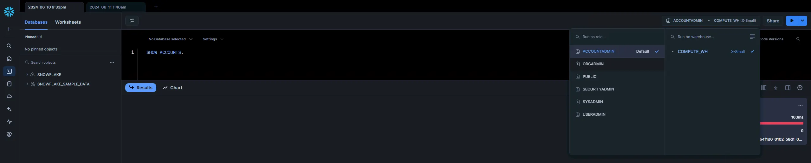

# SnowHound

## Overview

The BloodHound extension for Snowflake provides a powerful way to visualize access control and potential attack paths within a Snowflake environment. By mapping key entities such as Users, Roles, Databases, Warehouses, and Integrations, along with the permissions that connect them, this extension enables security teams to gain a comprehensive understanding of their Snowflake landscape. The extension leverages Snowflake’s Role-Based Access Control (RBAC) model, allowing organizations to identify and address attack paths in their Snowflake tenants. With this tool, users can explore how access is granted, track potential attack paths, and implement effective security strategies to mitigate risk in their Snowflake accounts.

## Collector Setup & Usage

### Collecting Data

The first step is to collect the graph-relevant data from Snowflake. The cool thing is that this is actually a relatively simple process. I’ve found that Snowflake’s default web client, Snowsight, does a fine job gathering this information. You can navigate to Snowsight once you’ve logged in by clicking on the Query data button at the top of the Home page.


Once there, you will have the opportunity to execute commands. This section will describe the commands that collect the data necessary to build the graph. My parsing script is built for CSV files that follow a specific naming convention. Once your command has returned results, click the download button (downward pointing arrow) and select the “Download as .csv” option.


The model supports Accounts, Applications, Databases, Roles, Users, and Warehouses. This means we will have to query those entities, which will serve as the nodes in our graph. This will download the file with a name related to your account. My parsing script expects the output of certain commands to be named in a specific way. The expected name will be shared in the corresponding sections below.

I’ve found that I can query Applications, Databases, Roles, and Users as an unprivileged user. However, this is different for Accounts, which require ORGADMIN, and Warehouses, which require instance-specific access (e.g., [ACCOUNTADMIN](https://docs.snowflake.com/en/user-guide/warehouses-tasks#delegating-warehouse-management)).

#### Applications

* Command: [SHOW APPLICATIONS;](https://docs.snowflake.com/en/sql-reference/sql/show-applications)
* File Name: application.csv

#### Databases

* Command: [SHOW DATABASES;](https://docs.snowflake.com/en/sql-reference/sql/show-databases)
* File Name: database.csv

#### Roles

* Command: [SHOW ROLES;](https://docs.snowflake.com/en/sql-reference/sql/show-roles)
* File Name: role.csv

#### Users

* Command: [SHOW USERS;](https://docs.snowflake.com/en/sql-reference/sql/show-users)
* File Name: user.csv

#### Warehouses

* Command: [SHOW WAREHOUSES;](https://docs.snowflake.com/en/sql-reference/sql/show-warehouses)
* File Name: warehouse.csv

Note: As mentioned above, users can only enumerate warehouses for which they have been granted privileges. One way to grant a non-ACCOUNTADMIN user visibility of all warehouses is to grant the [MANAGE WAREHOUSES](https://docs.snowflake.com/en/user-guide/warehouses-tasks#delegating-warehouse-management) privilege.

#### Accounts

At this point, we have almost all the entity data we need. We have one final query that will allow us to gather details about our Snowflake account. This query can only be done by the ORGADMIN role. Assuming your user has been granted ORGADMIN, go to the top right corner of the browser and click on your current role. This will result in a drop-down that displays all of the roles that are effectively granted to your user. Here, you will select ORGADMIN, allowing you to run commands in the context of the ORGADMIN role.



Once complete, run the following command to list the account details.

* Command: [SHOW ACCOUNTS;](https://docs.snowflake.com/en/sql-reference/sql/show-accounts)
* File Name: account.csv

#### Grants

Finally, we must gather information on privilege grants. These are maintained in the ACCOUNT_USAGE schema of the default SNOWFLAKE database. By default, these views are only available to the ACCOUNTADMIN role. Still, users not granted USAGE of the ACCOUNTADMIN role can be granted the necessary read access via the [SECURITY_VIEWER](https://docs.snowflake.com/en/sql-reference/account-usage#account-usage-views-by-database-role) database role. The following command does this (if run as ACCOUNTADMIN):

```
GRANT DATABASE ROLE snowflake.SECURITY_VIEWER TO <Role>
```

Once you have the necessary privilege, you can query the relevant views and export them to a CSV file. The first view is [grants_to_users](https://docs.snowflake.com/en/sql-reference/account-usage/grants_to_users), which maintains a list of which roles have been granted to which users. You can enumerate this list using the following command. Then save it to a CSV file and rename it grants_to_users.csv.

```
SELECT * FROM snowflake.account_usage.grants_to_users;
```

The final view is [grants_to_roles](https://docs.snowflake.com/en/sql-reference/account-usage/grants_to_roles), which maintains a list of all the privileges granted to roles. This glue ultimately allows users to interact with the different Snowflake entities. This view can be enumerated using the following command. The results should be saved as a CSV file named grants_to_roles.csv.

```
SELECT * FROM snowflake.account_usage.grants_to_roles WHERE GRANTED_ON IN ('ACCOUNT', 'APPLICATION', 'DATABASE', 'INTEGRATION', 'ROLE', 'USER', 'WAREHOUSE');
```

### Generating BloodHound OpenGraph Payload

After you've collected the relevant data from your Snowflake tenant, you must convert it from csv to a BloodHound OpenGraph payload. This is done via the [snowhound.ps1](./snowhound.ps1) script found in this repository.

1) In a PowerShell terminal, navigate to the folder where the Snowflake csv files are located.

2) Load snowhound.ps1 into your PowerShell session:

```powershell
. ./snowhound.ps1
```

3) Execute the Invoke-SnowHound function:

```powershell
Invoke-SnowHound
```

SnowHound will output a payload to your current working directory called `snowhound_<accountid>.json`

4) Upload the payload via BloodHound's File Ingest page

## Schema

The schema defines the structure and relationships between various entities in the Snowflake environment, which are critical for mapping access and attack paths. In this extension, the schema consists of several key node types, including SNOWAccount, SNOWUser, SNOWRole, SNOWWarehouse, SNOWDatabase, and SNOWIntegration. These nodes are interconnected through edges that represent permissions, access grants, and roles, showing how users and services interact with Snowflake resources.

The schema allows you to visualize the relationships between users, roles, databases, and other entities in your Snowflake account, providing a comprehensive view of your environment’s security posture. By defining these entities and their permissions, the schema enables you to identify potential attack paths, privilege escalation opportunities, and access risks. Each node type is linked through explicit access permissions, ensuring a clear mapping of how users and roles can exploit vulnerabilities or gain access to sensitive data.


Below is the complete set of nodes and edges as defined in the [model](./model.json).

### Nodes

Nodes correspond to each object type.

| Node                                                                           | Description                                                                                                                                | Icon        | Color   |
|--------------------------------------------------------------------------------|--------------------------------------------------------------------------------------------------------------------------------------------|-------------|---------|
|  SNOWAccount             | The top-level container for all Snowflake resources such as users, roles, databases, and integrations.                                     | building    | #5FED83 |
|  SNOWUser                   | Represents an individual user in a Snowflake account, linked to roles, warehouses, and databases that define their access.                 | user        | #FF8E40 |
|  SNOWRole                   | Represents a role in Snowflake that defines a set of permissions, which can be assigned to users or other roles.                           | user-group  | #C06EFF |
|  SNOWWarehouse         | Represents a Snowflake virtual warehouse providing computational resources for running queries, with access controlled by roles and users. | warehouse   | #9EECFF |
|  SNOWDatabase           | Represents a Snowflake database, linked to users, roles, and warehouses that have access to it.                                            | database    | #FF80D2 |
|  SNOWIntegration     | Represents an integration with an external system or service in Snowflake, such as a data pipeline or third-party application.             | user-tie    | #BFFFD1 |

### Edges

Edges capture every relationship; who contains what, membership, view vs. manage permissions, etc.

NOTE: I need to go back and add SNOWContains edges from the SNOWAccount to all of the components of the account.

| Edge Type                         | Source            | Target            | Travesable |
|-----------------------------------|-------------------|-------------------| ---------- |
| `SNOWUsage`                       | `SNOWApplication` | `SNOWDatabase`    |            |
| `SNOWUsage`                       | `SNOWRole`        | `SNOWDatabase`    |            |
| `SNOWUsage`                       | `SNOWRole`        | `SNOWIntegration` |            |
| `SNOWUsage`                       | `SNOWRole`        | `SNOWRole`        |            |
| `SNOWUsage`                       | `SNOWRole`        | `SNOWUser`        |            |
| `SNOWUsage`                       | `SNOWRole`        | `SNOWWarehouse`   |            |
| `SNOWOwnership`                   | `SNOWRole`        | `SNOWDatabase`    |            |
| `SNOWOwnership`                   | `SNOWRole`        | `SNOWIntegration` |            |
| `SNOWOwnership`                   | `SNOWRole`        | `SNOWRole`        |            |
| `SNOWOwnership`                   | `SNOWRole`        | `SNOWUser`        |            |
| `SNOWOwnership`                   | `SNOWRole`        | `SNOWWarehouse`   |            |
| `SNOWApplyBudget`                 | `SNOWRole`        | `SNOWDatabase`    |            |
| `SNOWApplyBudget`                 | `SNOWRole`        | `SNOWWarehouse`   |            |
| `SNOWAudit`                       | `SNOWRole`        | `SNOWAccount`     |            |
| `SNOWModify`                      | `SNOWRole`        | `SNOWDatabase`    |            |
| `SNOWModify`                      | `SNOWRole`        | `SNOWWarehouse`   |            |
| `SNOWMonitor`                     | `SNOWRole`        | `SNOWAccount`     |            |
| `SNOWMonitor`                     | `SNOWRole`        | `SNOWDatabase`    |            |
| `SNOWMonitor`                     | `SNOWRole`        | `SNOWWarehouse`   |            |
| `SNOWOperate`                     | `SNOWRole`        | `SNOWWarehouse`   |            |
| `SNOWApplyAggregationPolicy`      | `SNOWRole`        | `SNOWAccount`     |            |
| `SNOWApplyAuthenticationPolicy`   | `SNOWRole`        | `SNOWAccount`     |            |
| `SNOWApplyMaskingPolicy`          | `SNOWRole`        | `SNOWAccount`     |            |
| `SNOWApplyPackagesPolicy`         | `SNOWRole`        | `SNOWAccount`     |            |
| `SNOWApplyPasswordPolicy`         | `SNOWRole`        | `SNOWAccount`     |            |
| `SNOWApplyProtectionPolicy`       | `SNOWRole`        | `SNOWAccount`     |            |
| `SNOWApplyRowAccessPolicy`        | `SNOWRole`        | `SNOWAccount`     |            |
| `SNOWApplySessionPolicy`          | `SNOWRole`        | `SNOWAccount`     |            |
| `SNOWAttachPolicy`                | `SNOWRole`        | `SNOWAccount`     |            |
| `SNOWBindServiceEndpoint`         | `SNOWRole`        | `SNOWAccount`     |            |
| `SNOWCancelQuery`                 | `SNOWRole`        | `SNOWAccount`     |            |
| `SNOWCreateAccount`               | `SNOWRole`        | `SNOWAccount`     |            |
| `SNOWCreateApiIntegration`        | `SNOWRole`        | `SNOWAccount`     |            |
| `SNOWCreateApplication`           | `SNOWRole`        | `SNOWAccount`     |            |
| `SNOWCreateApplicationPackage`    | `SNOWRole`        | `SNOWAccount`     |            |
| `SNOWCreateComputerPool`          | `SNOWRole`        | `SNOWAccount`     |            |
| `SNOWCreateCredential`            | `SNOWRole`        | `SNOWAccount`     |            |
| `SNOWCreateDataExchangeListing`   | `SNOWRole`        | `SNOWAccount`     |            |
| `SNOWCreateDatabase`              | `SNOWRole`        | `SNOWAccount`     |            |
| `SNOWCreateDatabaseRole`          | `SNOWRole`        | `SNOWDatabase`    |            |
| `SNOWCreateExternalVolume`        | `SNOWRole`        | `SNOWAccount`     |            |
| `SNOWCreateIntegration`           | `SNOWRole`        | `SNOWAccount`     |            |
| `SNOWCreateNetworkPolicy`         | `SNOWRole`        | `SNOWAccount`     |            |
| `SNOWCreateReplicationGroup`      | `SNOWRole`        | `SNOWAccount`     |            |
| `SNOWCreateRole`                  | `SNOWRole`        | `SNOWAccount`     |            |
| `SNOWCreateSchema`                | `SNOWRole`        | `SNOWDatabase`    |            |
| `SNOWCreateShare`                 | `SNOWRole`        | `SNOWAccount`     |            |
| `SNOWCreateUser`                  | `SNOWRole`        | `SNOWAccount`     |            |
| `SNOWCreateWarehouse`             | `SNOWRole`        | `SNOWAccount`     |            |
| `SNOWExecuteDataMetricFunction`   | `SNOWRole`        | `SNOWAccount`     |            |
| `SNOWExecuteManagedAlert`         | `SNOWRole`        | `SNOWAccount`     |            |
| `SNOWExecuteManagedTask`          | `SNOWApplication` | `SNOWAccount`     |            |
| `SNOWExecuteManagedTask`          | `SNOWRole`        | `SNOWAccount`     |            |
| `SNOWExecuteTask`                 | `SNOWApplication` | `SNOWAccount`     |            |
| `SNOWExecuteTask`                 | `SNOWRole`        | `SNOWAccount`     |            |
| `SNOWImportShare`                 | `SNOWRole`        | `SNOWAccount`     |            |
| `SNOWManageGrants`                | `SNOWRole`        | `SNOWAccount`     |            |
| `SNOWManageWarehouses`            | `SNOWRole`        | `SNOWAccount`     |            |
| `SNOWManagementSharing`           | `SNOWRole`        | `SNOWAccount`     |            |
| `SNOWMonitorExecution`            | `SNOWRole`        | `SNOWAccount`     |            |
| `SNOWOverrideShareRestrictions`   | `SNOWRole`        | `SNOWAccount`     |            |
| `SNOWPurchaseDataExchangeListing` | `SNOWRole`        | `SNOWAccount`     |            |
| `SNOWReferenceUsage`              | `SNOWRole`        | `SNOWDatabase`    |            |
| `SNOWUseAnyRole`                  | `SNOWRole`        | `SNOWIntegration` |            |

## Usage Examples


## Contributing

We welcome and appreciate your contributions! To make the process smooth and efficient, please follow these steps:

1. **Discuss Your Idea**  
   - If you’ve found a bug or want to propose a new feature, please start by opening an issue in this repo. Describe the problem or enhancement clearly so we can discuss the best approach.

2. **Fork & Create a Branch**  
   - Fork this repository to your own account.  
   - Create a topic branch for your work:
     ```bash
     git checkout -b feat/my-new-feature
     ```

3. **Implement & Test**  
   - Follow the existing style and patterns in the repo.  
   - Add or update any tests/examples to cover your changes.  
   - Verify your code runs as expected:
     ```bash
     # e.g. dot-source the collector and run it, or load the model.json in BloodHound
     ```

4. **Submit a Pull Request**  
   - Push your branch to your fork:
     ```bash
     git push origin feat/my-new-feature
     ```  
   - Open a Pull Request against the `main` branch of this repository.  
   - In your PR description, please include:
     - **What** you’ve changed and **why**.  
     - **How** to reproduce/test your changes.

5. **Review & Merge**  
   - I’ll review your PR, give feedback if needed, and merge once everything checks out.  
   - For larger or more complex changes, review may take a little longer—thanks in advance for your patience!

Thank you for helping improve this extension! 🎉  

## Licensing

```
Copyright 2025 Jared Atkinson

Licensed under the Apache License, Version 2.0
you may not use this file except in compliance with the License.
You may obtain a copy of the License at

    http://www.apache.org/licenses/LICENSE-2.0

Unless required by applicable law or agreed to in writing, software
distributed under the License is distributed on an "AS IS" BASIS,
WITHOUT WARRANTIES OR CONDITIONS OF ANY KIND, either express or implied.
See the License for the specific language governing permissions and
limitations under the License.
```

Unless otherwise annotated by a lower-level LICENSE file or license header, all files in this repository are released
under the `Apache-2.0` license. A full copy of the license may be found in the top-level [LICENSE](LICENSE) file.
