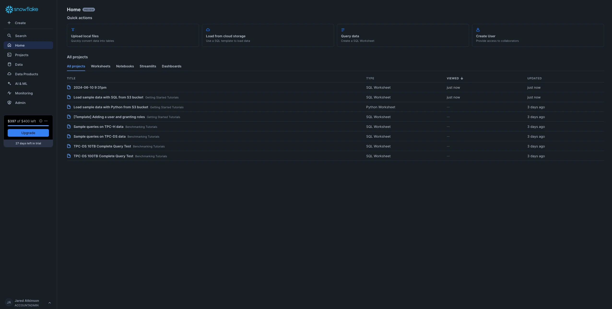
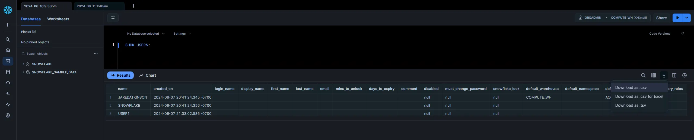

# Legacy SnowHound Collection

## Collecting Data

The first step is to collect the graph-relevant data from Snowflake. The cool thing is that this is actually a relatively simple process. I’ve found that Snowflake’s default web client, Snowsight, does a fine job gathering this information. You can navigate to Snowsight once you’ve logged in by clicking on the Query data button at the top of the Home page.



Once there, you will have the opportunity to execute commands. This section will describe the commands that collect the data necessary to build the graph. My parsing script is built for CSV files that follow a specific naming convention. Once your command has returned results, click the download button (downward pointing arrow) and select the “Download as .csv” option.



The model supports Accounts, Applications, Databases, Roles, Users, and Warehouses. This means we will have to query those entities, which will serve as the nodes in our graph. This will download the file with a name related to your account. My parsing script expects the output of certain commands to be named in a specific way. The expected name will be shared in the corresponding sections below.

I’ve found that I can query Applications, Databases, Roles, and Users as an unprivileged user. However, this is different for Accounts, which require ORGADMIN, and Warehouses, which require instance-specific access (e.g., [ACCOUNTADMIN](https://docs.snowflake.com/en/user-guide/warehouses-tasks#delegating-warehouse-management)).

### Accounts

* Command: [SELECT * FROM snowflake.organization_usage.accounts WHERE account_locator = CURRENT_ACCOUNT();](https://docs.snowflake.com/en/sql-reference/sql/show-accounts)
* File Name: accounts.csv

### Applications

* Command: [SHOW APPLICATIONS;](https://docs.snowflake.com/en/sql-reference/sql/show-applications)
* File Name: applications.csv

### Databases

* Command: [SELECT * FROM snowflake.account_usage.databases;](https://docs.snowflake.com/en/sql-reference/sql/show-databases)
* File Name: databases.csv

### Schemas

* Command: [SHOW SCHEMAS;](https://docs.snowflake.com/en/sql-reference/sql/show-schemas)
* File Name: schemas.csv

### Roles

* Command: [SELECT * FROM snowflake.account_usage.roles;](https://docs.snowflake.com/en/sql-reference/sql/show-roles)
* File Name: roles.csv

### Users

* Command: [SELECT * FROM snowflake.account_usage.users;](https://docs.snowflake.com/en/sql-reference/sql/show-users)
* File Name: users.csv

### Warehouses

* Command: [SHOW WAREHOUSES;](https://docs.snowflake.com/en/sql-reference/sql/show-warehouses)
* File Name: warehouses.csv

Note: As mentioned above, users can only enumerate warehouses for which they have been granted privileges. One way to grant a non-ACCOUNTADMIN user visibility of all warehouses is to grant the [MANAGE WAREHOUSES](https://docs.snowflake.com/en/user-guide/warehouses-tasks#delegating-warehouse-management) privilege.

### Integrations

* Command: [SHOW INTEGRATIONS;](https://docs.snowflake.com/en/sql-reference/sql/show-integrations)
* File Name: integrations.csv

### Grants

Finally, we must gather information on privilege grants. These are maintained in the ACCOUNT_USAGE schema of the default SNOW_FLAKE database. By default, these views are only available to the ACCOUNTADMIN role. Still, users not granted USAGE of the ACCOUNTADMIN role can be granted the necessary read access via the [SECURITY_VIEWER](https://docs.snowflake.com/en/sql-reference/account-usage#account-usage-views-by-database-role) database role. The following command does this (if run as ACCOUNTADMIN):

```sql
GRANT DATABASE ROLE snowflake.SECURITY_VIEWER TO <Role>
```

Once you have the necessary privilege, you can query the relevant views and export them to a CSV file. The first view is [grants_to_users](https://docs.snowflake.com/en/sql-reference/account-usage/grants_to_users), which maintains a list of which roles have been granted to which users. You can enumerate this list using the following command. Then save it to a CSV file and rename it grants_to_users.csv.

```sql
SELECT * FROM snowflake.account_usage.grants_to_users;
```

The final view is [grants_to_roles](https://docs.snowflake.com/en/sql-reference/account-usage/grants_to_roles), which maintains a list of all the privileges granted to roles. This glue ultimately allows users to interact with the different Snowflake entities. This view can be enumerated using the following command. The results should be saved as a CSV file named grants_to_roles.csv.

```sql
SELECT * FROM snowflake.account_usage.grants_to_roles WHERE GRANTED_ON IN ('ACCOUNT', 'APPLICATION', 'DATABASE', 'INTEGRATION', 'ROLE', 'SCHEMA', 'USER', 'WAREHOUSE');
```

## Generating BloodHound OpenGraph Payload

After you've collected the relevant data from your Snowflake tenant, you must convert it from csv to a BloodHound OpenGraph payload. This is done via the [snowhound.ps1](./snowhound.ps1) script found in this repository.

1) In a PowerShell terminal, navigate to the folder where the Snowflake csv files are located.

2) Load snowhound.ps1 into your PowerShell session:

    ```powershell
    . ./snowhound.ps1
    ```

3) Execute the Invoke-SnowHound function:

    ```powershell
    Invoke-SnowHound
    ```

    SnowHound will output a payload to your current working directory called `snowhound_output.json`

4) Upload the payload via BloodHound's File Ingest page
